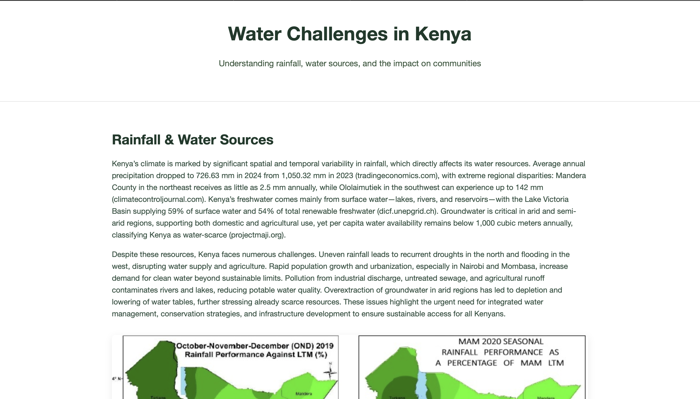
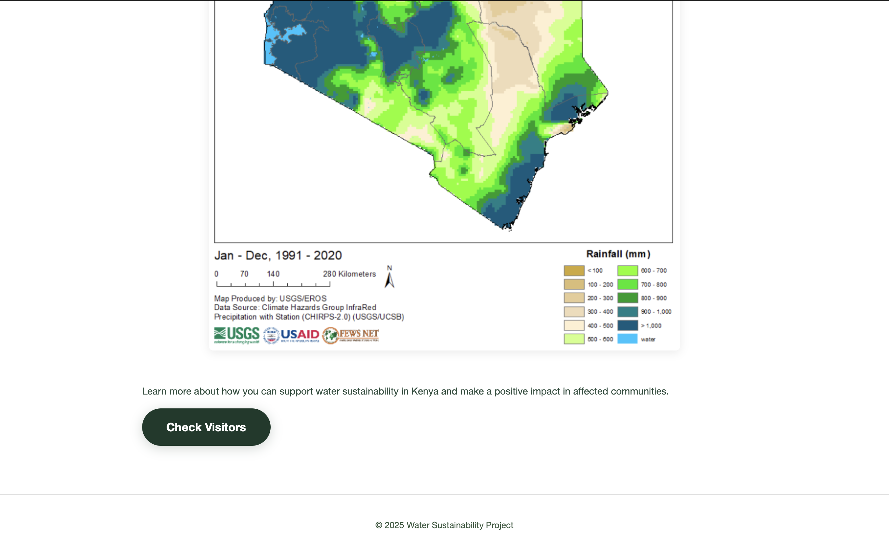
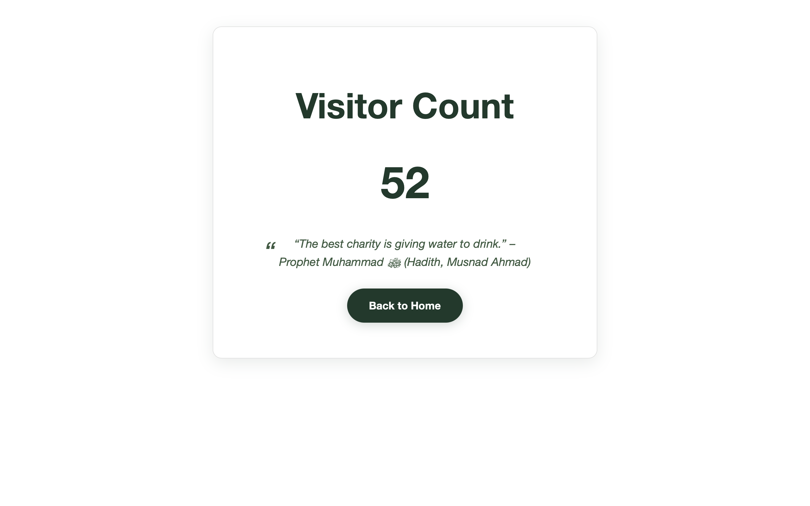

# Docker— CoderCo Module

## Overview of Skills Learned

During my Docker learning journey at **CoderCo**, I gained both theoretical understanding and hands-on skills in containerisation, application deployment, and DevOps practices.  
Here are the key skills and concepts I mastered:

### 1. Docker Fundamentals
- Understanding the concept of **containers** vs **virtual machines**.
- Learning how Docker improves application portability and reproducibility.
- Using Docker **images** and understanding image layers.

### 2. Docker CLI Commands
- Mastering essential commands:
  - `docker run`, `docker ps`, `docker stop`, `docker start`
  - `docker exec`, `docker logs`
  - `docker build`, `docker images`, `docker rmi`
  - `docker network` and `docker volume`
- Debugging containers and viewing logs.

### 3. Dockerfiles
- Writing custom **Dockerfiles** to define application environments.
- Using best practices:
  - Minimal base images
  - Layer caching
  - Multi-stage builds
- Example skills:
  - Installing dependencies inside containers.
  - Copying application files into container images.
  - Defining `ENTRYPOINT` and `CMD`.

### 4. Docker Compose & YAML Configuration
- Understanding the **`docker-compose.yml`** structure.
- Defining multi-container applications.
- Mapping ports for public access.
- Linking services together using Docker networks.
- Mastering docker compose commands:
  - `docker compose up`, `docker compose down`
  - `docker compose up --build`, `docker compose down -v`

### 5. Volumes
- Understanding **named volumes**.
- Using volumes to persist application data.
- Practical use cases:
  - **Redis volume** for data persistence.
  - Mounting local development files for live code changes.
- Separating application logic from storage.

### 6. Environment Variables
- Using `.env` files in conjunction with Docker Compose.
- Understanding environment-specific configuration for dev, test, and production.

### 7. Python App Integration
- Building and running **Python web applications** inside Docker.
- Using **Flask** to create dynamic web pages.
- Linking Flask with persistent storage for functionality.
- Debugging and testing Python applications inside containers.

### 8. Development Workflow
- Using **VS Code** as the main development environment.
- Structuring projects for maintainability:
  - `app/` for source code.
  - `Dockerfile` and `docker-compose.yml` in root.
- Using Git for version control.

---

## Assignment Details
- **Module**: Docker — CoderCo 
- **Task**: Building a Multi-Container Application
- **Challenge Name**: CoderCo Containers Challenge 
- **Key Requirements**:
  - Create a multi-container application that consists of a simple Python Flask web application and a Redis database. The Flask application should use Redis to store and retrieve data.  
**Bonus**:
  - Persistent Storage for Redis: Configure Redis to use a volume to persist its data.
  - Environment Variables: Modify the Flask application to read Redis connection details from environment variables and update the docker-compose.yml accordingly.

---

## The CodeCode Challenge — **Water Issues Kenya** Project

The final challenge in the Docker module was to create a **Dockerised web application** with persistent functionality.  

I developed **Water Issues Kenya** — a visitor counter web app with educational content about rainfall, water sources, and sustainability issues in Kenya.

### **Features**
- **Home Page**:
  - Eye-catching layout with background images.
  - Introduction to rainfall patterns and water sources in Kenya.
  - Call-to-action button linking to visitor count page.

- **Visitor Count Page**:
  - Live visitor counter powered by **Redis** for persistence.
  - Inspirational rotating charity quotes.
  - Option to return to home page.

- **Static Assets**:
  - Educational images of affected areas in Kenya.
  - Graphs and diagrams about rainfall data.
  - Custom **CSS styling** for a professional look.
  - Created structured projects for maintainability on VS Code:
      - `static/` for images, CSS, and JS.
      - `templates/` for HTML pages.

- **Backend**:
  - Flask Python application serving HTML templates.
  - Redis volume for storing visit counts.
  - Randomised quotes served on each refresh.

- **Docker Architecture**:
  - Multi-container setup:
    - Flask app container.
    - Redis container with persistent volume.
  - `docker-compose.yml` to define services, volumes, and networks.
  - Environment variables for configuration.

---

## How It Works
1. **Home Page** introduces the project and contains a **Visit Counter button**.
2. Clicking the button takes the user to the **Count Page**, which:
   - Displays total visitors (count persisted in Redis).
   - Shows a random quote on charity.
3. The app runs entirely inside Docker containers, making it **portable and reproducible**.

---

## Tech Stack
- **Languages & Frameworks**: Python (Flask), HTML, CSS, JavaScript
- **Datastore**: Redis (persistent volume)
- **Containerisation**: Docker, Docker Compose
- **Tools**: VS Code, Git
- **Hosting**: Local Docker environment (portable to cloud)

---

## Screenshots

### 1. Home Page

### 2. Visitor Button

### 3. Count Page

---

**Outcome**:  
Successfully implemented a fully functioning, Dockerised visitor counter application with educational content, meeting all requirements of the CodeCode challenge.
