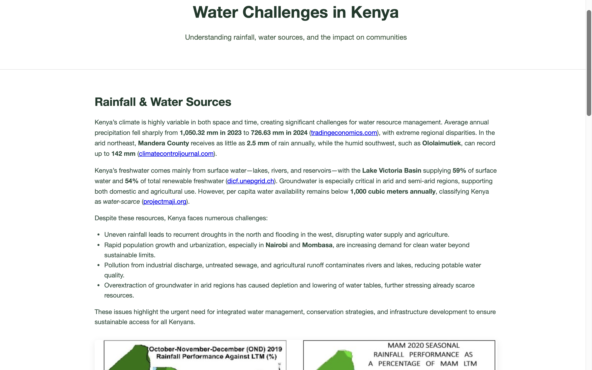
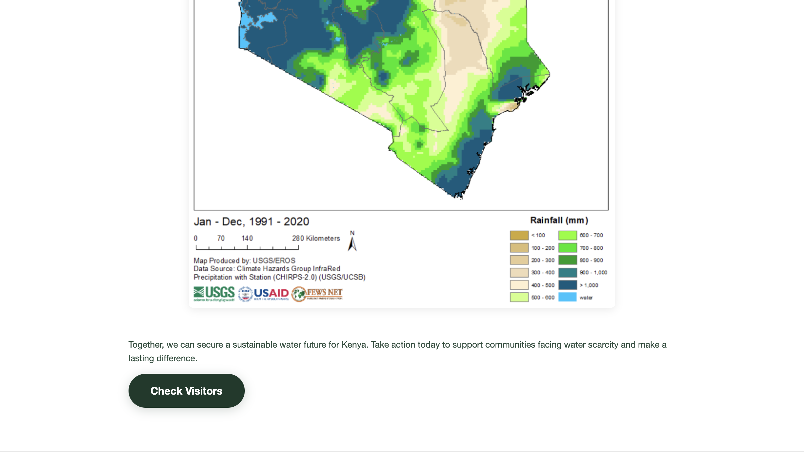

# Docker — CoderCo Module

## Overview of Skills Learned

During my **Docker learning journey at CoderCo**, I gained both theoretical knowledge and hands-on experience with containerisation, application deployment, and DevOps best practices. This module helped me understand how to design, build, and manage portable applications using Docker.  

Key skills and concepts I mastered include:

### **1. Docker Fundamentals**
- Understanding the differences between **containers** and **virtual machines**.
- Learning how Docker enhances **portability, scalability, and reproducibility**.
- Working with Docker **images** and understanding image layers.

### **2. Docker CLI Commands**
- Mastered essential commands for managing containers:
  - `docker run`, `docker ps`, `docker stop`, `docker start`
  - `docker exec`, `docker logs`
  - `docker build`, `docker images`, `docker rmi`
  - `docker network` and `docker volume`
- Debugging and inspecting containers to ensure smooth operation.

### **3. Dockerfiles**
- Writing **custom Dockerfiles** to define application environments.
- Following best practices:
  - Using **minimal base images**.
  - Leveraging **layer caching**.
  - Implementing **multi-stage builds**.
- Practical skills:
  - Installing dependencies inside containers.
  - Copying application files into images.
  - Defining `ENTRYPOINT` and `CMD` for execution.

### **4. Docker Compose & YAML Configuration**
- Understanding the **`docker-compose.yml`** structure.
- Defining multi-container applications and linking services via Docker networks.
- Mapping ports for public access and ensuring smooth service communication.
- Mastered commands:
  - `docker compose up`, `docker compose down`
  - `docker compose up --build`, `docker compose down -v`

### **5. Volumes**
- Using **named volumes** to persist data beyond container lifetimes.
- Practical use cases:
  - **Redis volume** for storing visitor counts.
  - Mounting local files for live development updates.
- Separation of application logic and storage for maintainability.

### **6. Environment Variables**
- Leveraging `.env` files with Docker Compose.
- Configuring applications for different environments: development, testing, and production.
- Passing dynamic configuration to containers via environment variables.

### **7. Python App Integration**
- Containerising **Python web applications** using Flask.
- Linking Flask apps with persistent storage for dynamic functionality.
- Debugging and testing Python applications inside containers.

### **8. Development Workflow**
- Using **VS Code** for project development.
- Structuring projects for clarity:
  - `app/` for source code.
  - `Dockerfile` and `docker-compose.yml` at the root.
- Version control with Git to manage code changes efficiently.

---

## Assignment Details
- **Module**: Docker — CoderCo  
- **Task**: Build a multi-container application  
- **Challenge Name**: CoderCo Containers Challenge  
- **Requirements**:
  - Create a Python Flask web application with a **Redis database**.
  - The Flask app should store and retrieve data from Redis.
- **Bonus**:
  - Persist Redis data using volumes.
  - Configure Flask to read Redis connection details from environment variables.

---

## The Code Challenge — **Water Issues Kenya**

For the final Docker module challenge, I built **Water Issues Kenya**, a fully containerised web application that educates users on rainfall patterns, water sources, and sustainability issues in Kenya while also featuring a **visitor counter**.

### **Project Highlights**
- **Home Page**:
  - Eye-catching layout with background imagery.
  - Educational content about Kenya’s water challenges.
  - Navigation to the visitor counter page.

- **Visitor Counter Page**:
  - Live visitor counter using **Redis** with persistent storage.
  - **Rotating inspirational quotes** about charity and sustainability on each refresh.
  - Return navigation to the home page.

- **Static Assets & Layout**:
  - Educational images and charts illustrating rainfall data.
  - Custom CSS for a polished, professional look.
  - Project structure in VS Code:
    - `static/` for CSS, JS, and images.
    - `templates/` for HTML pages.

- **Backend**:
  - Flask Python application serving HTML templates.
  - Redis volume to store and persist visitor counts.
  - Randomised quotes displayed on every page refresh.

- **Docker Architecture**:
  - Multi-container setup:
    - Flask application container.
    - Redis container with persistent volume.
  - `docker-compose.yml` defines services, networks, and volumes.
  - Environment variables for configuration.

---

## How It Works
1. **Home Page** introduces the project and contains a **Visit Counter button**.
2. Clicking the button navigates to the **Count Page**, which:
   - Displays total visitors (persisted in Redis).
   - Shows a randomly selected inspirational quote on each refresh.
3. The app runs entirely inside Docker containers, making it **portable, reproducible, and easy to deploy**.

---

## Tech Stack
- **Languages & Frameworks**: Python (Flask), HTML, CSS, JavaScript  
- **Datastore**: Redis (persistent volume)  
- **Containerisation**: Docker, Docker Compose  
- **Tools**: VS Code, Git  
- **Hosting**: Local Docker environment (portable to cloud)

---

## What I Learned & Gained
- Strong understanding of **containerisation** and **Docker architecture**.  
- Practical experience in **building multi-container applications** with Docker Compose.  
- Confidence in using **Docker CLI commands** and writing **Dockerfiles** for custom environments.  
- Knowledge of **data persistence using volumes** and environment-based configuration.  
- Ability to **containerise Python applications** and integrate them with services like Redis.  
- Developed skills in **debugging, testing, and deploying containerised applications**.  
- Appreciation for **clean project structure**, reproducibility, and portability in real-world applications.  
- Enhanced **problem-solving, project planning, and DevOps mindset** for software development.
## Screenshots

### 1. Home Page

### 2. Visitor Button

### 3. Count Page

---

**Outcome**:  
Successfully implemented a fully functioning, Dockerised visitor counter application with educational content, meeting all requirements of the CodeCode challenge.
